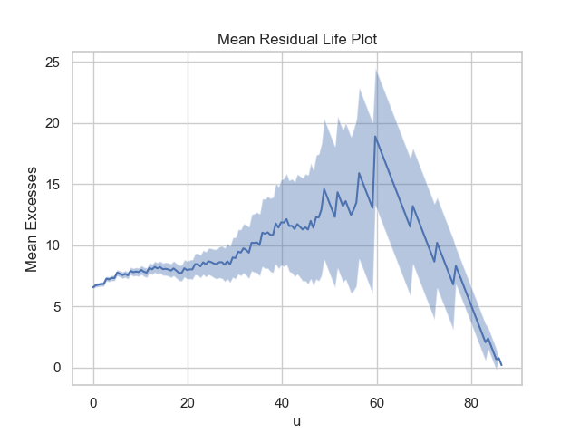
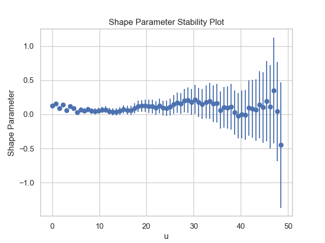
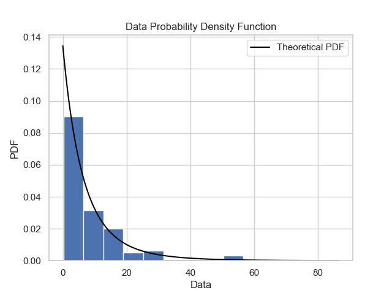
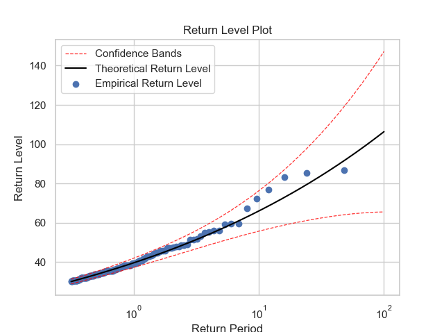

# Summary

Extreme value analysis has been emerged as one of the most important disciplines
for the applied sciences when dealig with reduced datasets and when the main idea is to
extrapolate the observations over a given time. With threshold models and adopting a asymtoptic model
characterization, which lead us to the Generalized Pareto Distribution (GPD), is possible to model 
a stochastic behavior of a given processes in an unusually level, being of minimum or maximum. 

In this context, this package provides a complete toolkit to conduct a threshold model analysis, since the threshold selection until deep and complex statistical analyses using the Peak-Over-Threshold Method combined to the Generalized Pareto Distribution.

Into a software context, it is possible to see a strong community working with ``R`` packages like ``POT`` [@POT],``evd`` [@evd] and ``extRemes`` [@extremes], which ones provides a complete extreme value modeling. 
Otherwise, in ``Python``, it is possible to find the ``scikit-extremes`` [@kiko], which one does not contemple the threshold models yet. In addition, another package is ``scipy``, with the ``genpareto`` [@scipy] functions,which also does not provide excesses modeling functions. Moreover, this package brings to the community a possibility to conduct a extreme value analysis using a strong, consolidated and high-level programming language given the importance of this approach in corrosion engineering [@scarf], [@tan], hydrology [@katz], enviromental data [@max],[@esther] and many other fields of natural sciences and engineering. 

Hence, the ``thresholdmodeling`` package presents numerous functions to model the stochastic behavior of a extreme process. For a complete introduction of the complete fifteen package functions it is crucial to go to the [Functions Documentation](https://github.com/iagolemos1/thresholdmodeling/blob/master/Functions%20Documentation.md), on the [GitHub page](https://github.com/iagolemos1/thresholdmodeling). 

## Threshold Selection
* **Mean Residual Life Plot** : It is possible to plot the Mean Residual Life function, as it is defined in [@coles];
* **Parameter Stability Plot** : Also, it is possible to get the two graphics related to the shape and the modified scale parameters stability plot, as they are defined in [@coles].

## Model Fit
* **Fit the GPD Model** : Fitting a given dataset to a GPD model using some methods (see [**Model Fit**](https://github.com/iagolemos1/thresholdmodeling/blob/master/Functions%20Documentation.md#model-fit)).

## Model Checking
* **Probability Density Function, Comulative Distribution Function, Quantile-Quantile and Probability-Probability Plots** : Plots the theoretical probability density function with the normalized empirical histograms for a given dataset, using some bin methods (see [``gpdpdf``](https://github.com/iagolemos1/thresholdmodeling/blob/master/Functions%20Documentation.md#model-fit)), the heoretical and empirical CDF with the Dvoretzky–Kiefer–Wolfowitz confidence bands and the QQ and PP plots, comparing the sample and the theoretical values. The first one uses the Kolmogorov-Smirnov Two Sample test for getting the confidence bands while the second one uses the Dvoretzky–Kiefer–Wolfowitz method.
* **L-Moments Plots** : L-Skewness against L-Kurtosis plot for a given threshold values using the Generalized Pareto parametrization. As warning, L-Moments plots are really difficult to interpret. See [@POT] and [@hosking] for more details.

## Model Diagnostics and Return Level Analysis
* **Return Level Computation and Plot** : Computing a return value for a given return period is also possible, with a confidence interval obtained by the Delta Method [@coles]. Furthermore, a return level plot is provided,using the Delta Method in order to obtain the confidence bands. In order to compare, the empirical return level plot is provided. 

## Declustering and Data Visualization
It is possible to visualize the data during the unit of a return period. Also, for a giving empirical rule (number of days, for example), it is possible to cluster the dataset and, taking the maximum observation of each cluster, a declustering of maximuns is done. 

## Further Functions
It is also possible to compute sample L-Moments, model L-Moments, non-central moments, differential entropy and the survival function plot. 

# Installation 

For installing the package just use the following command (it is already in PyPi): 
```
pip install thresholdmodeling
```
The Python dependencies for runing the software will install automatically with this command.

Once the package is installed, it is necessary to run this lines on your IDE for installing ``POT`` package:
```python
from rpy2.robjects.packages import importr
import rpy2.robjects.packages as rpackages

base = importr('base')
utils = importr('utils')
utils.chooseCRANmirror(ind=1)
utils.install_packages('POT') #installing POT package
```
# Reproducibility and User's Guide

In the repository on [GitHub page](https://github.com/iagolemos1/thresholdmodeling) is possible
to get the dataset: Daily Rainfall in the South-West of England from 1914 to 1962. 
Using it is a way of confronting the software in order to verify its results and compare it with the forseen ones in [@coles]. For a more detailed tutorial of the using of each function, go to the [Test](https://github.com/iagolemos1/thresholdmodeling/blob/master/Test/test.py) folder.

A fast tutorial on how to use the software and get the results presented by [@coles] is given below. For information about the functions employed see the [Functions Documentation](https://github.com/iagolemos1/thresholdmodeling/blob/master/Functions%20Documentation.md).

```python
from thresholdmodeling import thresh_modeling 
import pandas as pd 

url = 'https://raw.githubusercontent.com/iagolemos1/thresholdmodeling/master/dataset/rain.csv'
df = pd.read_csv(url, error_bad_lines=False) 
data = df.values 

thresh_modeling.MRL(data, 0.05) 
thresh_modeling.Parameter_Stability_plot(data, 0.05) 
thresh_modeling.gpdpdf(data, 30, 'mle', 'sturges', 0.05) 
thresh_modeling.qqplot(data, 30, 'mle', 0.05) 
thresh_modeling.ppplot(data, 30, 'mle', 0.05) 
thresh_modeling.gpdcdf(data, 30, 'mle', 0.05) 
thresh_modeling.return_value(data, 30, 0.05, 365, 36500, 'mle') 
``` 


**Fig. 1:** Mean Residual Life Plot for the daily rainfall dataset.



**Fig. 2:** Shape Parameter Stability Plot for the daily rainfall dataset.


**Fig. 3:** Modified Scale Parameter Stability Plot for the daily rainfall dataset.



**Fig. 4:** Probability density function plot for the given dataset with empirical histograms.


**Fig. 5:** Quantile-Quantile plot with the confidence bands based on the Kolmogorov-Sminorv two sample test.


**Fig. 6:** Probability-Probability plot with the confidence bands based on the Dvoretzky–Kiefer–Wolfowitz method.


**Fig. 7:** Comulative distribution function with the empirical points and the confidence bands based on the Dvoretzky–Kiefer–Wolfowitz method.




**Fig. 8:** Return level plot with the empirical estimatives of the return level and the confidence bands based on the Delta Method.

Also, for the given return period (100 years), the software presentes the following results in the terminal:
```
The return value for the given return period is 106.34386649996667 ± 40.86691363790978
```

For more details, the documentation is up-to-date on the [GitHub page](https://github.com/iagolemos1/thresholdmodeling).

# Acknowledgements

The authors would like to thanks the School of Mechanical Engineering at Federal University of Uberlândia and CNPq and CAPES for the financial support to this research.

# References

